# UPI City

A live simulation of a UPI-style payment network, used as a testbed to measure
**how well fraud detection actually works** — including how often it is wrong.

Synthetic customers, merchants and banks transact continuously. Chaos is
injected into the running network (fraud rings, bank outages). A detection
layer scores the live stream. Every number it produces is then checked against
ground truth the detector was never allowed to see.

> **Status: complete, plus two extensions.** Days 1-10 as planned, then an
> expected-loss model and an adaptive adversary — the two gaps that most
> separated this from something a risk team could act on. Engine,
> ground-truth firewall, determinism gate, two chaos scenarios, three scored
> detectors, the metrics layer, signal fusion, isotonic calibration, the
> detector-comparison harness, the allow/review/block decision layer, the
> LLM audit-trail layer, replay mode, the graph-propagation ablation, a static
> HTML report, a live dashboard and the 5,000-agent scale-up are built and
> passing. See `DEMO.md` for the walkthrough.

---

## Why this exists

Testing whether a fraud detector works requires knowing which transactions
were actually fraudulent. On production traffic you never know that — you only
know what you caught. So real precision and recall are unmeasurable, and teams
end up reporting the one number they can see: alerts raised.

A simulator makes the unmeasurable measurable. The cost is that the numbers
describe *this simulator's assumptions* rather than real UPI traffic — which
is stated plainly rather than glossed over, and then **measured**: the same
detectors are run against 590,540 real labelled payments in
[The real-data check](#the-real-data-check), where the one detector that data
can test transfers at chance. The gap is quantified rather than caveated.

## What makes the numbers trustworthy

The easy version of this project is a simulator that generates obvious fraud
and a detector that catches it — a benchmark that proves nothing. Four things
are built specifically to prevent that:

**1. Detectors cannot see ground truth.** `internal/obs` defines the only
transaction view detectors ever receive; it has no label field. Labels live in
`internal/truth`, which `internal/detect` may not import. This is enforced by
a test that walks the real dependency graph and fails the build on violation —
and the guard is itself verified by introducing a deliberate leak and
confirming it fires, because an untested guard is not a guard.

**2. Legitimate traffic is deliberately hard.** Three archetypes exist to be
mistaken for fraud, so the false-positive rate is structurally non-zero:

| Signal | Fraud version | Legitimate twin | What actually separates them |
|---|---|---|---|
| High velocity / fan-in | mule collection hub | `MegaMerchant` | payer **recurrence**; a merchant's customers return, a mule's are new |
| One-to-many burst | ring disbursal | `PayrollDisburser` | amount **dispersion**; salaries cluster tightly |
| Circular flow | layering cycle | `SupplyChainPair` | traversal **speed** and value retention; trade credit returns value |

Cycle *existence* is not a fraud signal — legitimate supply chains form
cycles. Speed and value retention are.

Two details here are load-bearing rather than decorative. Supply chains trade
in **triangles**, not pairs, because the cycle detector excludes 2-cycles
outright and a population of only pairs would let that exclusion look like
insight while nothing legitimate ever tested it. And payroll rosters carry
**hiring and attrition**, because a roster frozen for the whole run is learned
after one cycle and scores zero forever — flattering the detector instead of
testing it.

**3. Recruitable accounts are invisible until recruited.** Mules and bots
behave exactly like consumers — same spend rate, same amounts, same salary,
same solvency — until a chaos scenario activates them. If dormant fraud
accounts behaved differently, the population itself would leak ground truth
regardless of how carefully the event type is guarded.

**4. Runs are reproducible.** Same seed, same event stream, byte for byte.
This is what makes it possible to compare two detector versions on *identical*
traffic, and to fit calibration on one set of seeds and report on another.
`results/` is committed and `just reproduce` re-runs every seed and diffs.

**5. Trivial scorers are on every chart.** A precision/recall curve alone is
decoration — 0.14 precision could be excellent or useless and the reader has
no way to tell. Random, always-flag, and ranking by amount alone appear on the
same axes. The last one is not a formality: it beat the real detectors 5:1 on
the first honest evaluation, and finding that out changed the simulator.

That baseline is a **rank**, not a threshold, and the difference turned out to
matter. As a fixed `amount > ₹50,000` rule it reported AUC-PR 0.017 on every
seed — bit-for-bit identical to always-flag, which reads like a rule that never
fires. It fires 1,082 times in a 20k-tick run and is wrong on all of them:
everything above ₹50,000 here is payroll or supply-chain settlement, and the
largest *fraudulent* payment is ₹48,504. So the constant sat at the 99.1st
percentile and saw only legitimate traffic, and a baseline that was maximally
wrong became indistinguishable from one that was switched off. Ranking instead
of thresholding reports 0.067 — four times prevalence, so amount is genuinely
informative here — and the detectors have to clear that instead of clearing
nothing.

## The real-data check

Everything above measures a detector against fraud this project invented. That
is the only way to know true recall — on production traffic you never learn
what you missed — but it is a closed loop: the fraud and the detector came out
of the same head, so their agreement is the expected outcome rather than
evidence of anything.

`just realdata` opens the loop. It scores **590,540 real card-not-present
payments with 20,663 processor-confirmed frauds** (IEEE-CIS / Vesta, 2019)
through the same `runner.Scorer`, the same fusion, and the same metrics code
that score the simulator. Provenance and SHA-256 are in `data/SOURCES.md`; the
file itself is not committed.

**Only one of three detectors can be tested.** The dataset has a payer and no
payee — no counterparty column, and `R_emaildomain` is a recipient *domain* on
23% of rows, not an account. Velocity baselines a payer against its own history
and works. Fan-in is a property of the receiving account and cycles need edges,
so both are unscorable here. Supplying a placeholder receiver would have been
worse than omitting them: every payment would land on one account, fanout would
report the largest mule hub ever constructed, and the number would be an
artefact of the placeholder. No public dataset carries a real payer→payee
payment graph with fraud labels, which is the reason this simulator exists.

### The result

```
                          AUC-PR    vs prevalence
velocity (real data)      0.0350        1.00x      ← chance
amount-rank (real data)   0.0385        1.10x
random                    0.0350        1.00x
prevalence                0.0350
```

**The velocity detector transfers to real card traffic at chance.** It scores
0.481 on the simulator and 0.035 — the base rate exactly — on real payments.

That is the honest headline, and it is not a bug in the harness: transaction
and fraud counts match the source file exactly, and `amount-rank` independently
reports the 1.10x lift you would predict from the amount distribution (median
fraud $75 against median legitimate $69).

### Why it fails, precisely

Not because it never fires. It raises 661 findings, and at the very top of its
score range precision reaches 0.065 against a 0.035 base rate — a genuine
1.86x lift. But recall there is 0.0075: 154 frauds out of 20,663.

The detector requires 12 transactions from one payer inside its window before
it will say anything — an activity floor that exists to stop quiet accounts
manufacturing enormous z-scores out of two payments. In the simulator, where
agents transact continuously, that floor costs nothing. Real cards are sparse:

```
cards with >=12 payments total                    3,813 of 13,553
...that can reach 12 IN-WINDOW at 300s                3
...at a 1-hour window                                50
...at a 24-hour window                              301
median card needs 28 DAYS to accumulate 12 payments
```

So the detector's activity floor encodes an assumption about traffic density
that real card data violates by orders of magnitude, and the failure is silent
— nothing errors, it simply never has enough history to speak.

**This is not an artefact of the time mapping.** One tick was mapped to one
real second, which is a choice, so `just realdata-sweep` re-runs at 12s and
288s per tick — stretching the velocity window from 5 minutes to 24 hours and
lifting findings from 661 to 17,810:

| seconds/tick | window | findings | AUC-PR |
|---|---|---|---|
| 1 | 5 min | 661 | 0.0350 |
| 12 | 1 hour | 6,223 | 0.0350 |
| 288 | 24 hours | 17,810 | 0.0353 |

Two orders of magnitude more findings moves AUC-PR by 0.0003.

There is also a ceiling no time scale reaches: **64.7% of the fraud here is a
single payment on a card with no repeat within ten minutes.** A velocity
detector cannot see a burst that does not exist, so most of this fraud was
never available to it.

### What this does and does not establish

It does not retract the simulated numbers. Recall against a known ground truth
is a real measurement, and it remains the thing production data cannot give
you.

What it establishes is the size of the gap between the two, measured rather
than asserted — and one specific mechanism for it. A detector tuned on a
simulator can be **inoperative** on real traffic while every test still passes,
because the assumption it breaks is about the shape of the traffic rather than
about anything in the code. That is a stronger argument for reading simulator
results carefully than any caveat paragraph, and it is not one this project
could have made without leaving the simulator.

## Running it

```bash
nix develop          # Go 1.26 and just — that is the whole toolchain
just live            # ← watch the network, localhost:8080
just test            # vet + unit tests, including the ground-truth firewall
just gate            # the determinism gate
just report          # full detection report for one run
just bench           # 10 seeds in parallel, with the spread + figures
just compare         # detector configs on identical traffic + calibration
just reproduce       # re-run all seeds, diff against committed results
just prove-firewall  # add a ground-truth leak, watch the build reject it
just chaos           # inject a fraud ring, show score separation
just report-html     # bundle results into one self-contained HTML page
just pregenerate     # write incident narratives so a demo never waits on a model
just record          # record a run to disk (events + labels + layout)
just replay          # play a recorded run back through the same pipeline
just explain-debug   # show what the numeral guard rejects, and why
just propagation     # ablation: does guilt-by-association help? (it does not)
just adversary       # let the attacker tune itself against a fixed policy
just scale           # 5,000-agent throughput
just realdata        # score 590k REAL labelled payments through the same code
just realdata-sweep  # ...at three time scales, to rule out a units artefact
```

`results/` is committed, so `just reproduce` lets a reader verify every
published number in one command.

## The live view

`just live` starts a single binary with the interface embedded — no dev
server, no `node_modules`, no second toolchain. Agents are drawn at fixed
positions; transactions animate as particles along the edge they actually
used; flagged agents pulse.

Four things on that page are arguments, not decoration:

**Inject chaos while it runs.** Fraud ring or bank outage, with ring size and
ramp length as sliders. The ramp matters: with instant-on fraud every detector
trips in the same tick and "detection latency" measures the polling interval
rather than the detector.

**Two live threshold sliders** — review and block — with the confusion matrix
and the decision counters recomputing as you drag them. This makes the trade
tangible rather than theoretical:

| review tau | TP | FP | precision | recall | FP/1k legit |
|---|---|---|---|---|---|
| 0.40 | 0 | 0 | — | 0.000 | 0.00 |
| 0.15 | 131 | 1 | 0.992 | 0.261 | 0.14 |
| 0.05 | 371 | 91 | 0.803 | 0.491 | 13.03 |

Loosen the threshold and you catch nearly twice as much fraud — at ninety times
the collateral damage. Counters reset on every change, because they were
accumulated under the old policy and mixing two policies into one number would
be meaningless.

**A ground-truth reveal toggle.** The wire carries each transaction's true
label alongside its score, attached *after* detection has run, so the
interface can recolour the particles by what was really happening. Seeing the
false positives and the misses live is more persuasive than any table. No
detector can see that field.

**A dropped-frame counter.** The simulation never blocks on a slow browser —
sends are non-blocking and dropped frames are counted and shown rather than
silently swallowed.

The detectors are pre-warmed before the page opens. They deliberately raise
nothing until they have history to judge against, so without this the first
~3,000 ticks produce no findings and a ring injected in that window is simply
invisible. The tick counter still starts where it really is.

## Replay

```bash
just record             # writes events, labels and layout to disk
just replay             # plays it back through the identical pipeline
```

A recorded run drives the dashboard through exactly the same detectors,
decision layer and wire protocol as a live one — a replay the interface could
distinguish would be useless as demo insurance. Verified: 123,155 events
recorded, 123,155 replayed, in settlement order, each exactly once.

The engine is deterministic, so re-running a seed would also reproduce a run —
but only while the engine is unchanged. A recording survives engine changes,
which is precisely when you most want to know whether a detector improved or
the world simply moved underneath it.

**Ground truth is written to a separate file.** `events.jsonl` is the
detector's view and stays exactly that; `labels.jsonl` holds the answers and
is opened only by the scoreboard. Mixing them would reopen through the replay
path the leak that package boundaries close everywhere else — so there is a
test asserting the recorded event schema contains nothing but observable
fields.

**A replay refuses chaos injection**, and the interface greys the buttons out
and says why. A recording's future is already written; accepting an injection
would make the panel claim something the data does not contain.

## Current numbers

10 seeds × 40,000 ticks, 300 agents, fraud ring injected at tick 4,000. The
whole sweep takes **1.0 seconds** across 28 cores.

```
                      mean       min      max
prevalence           1.671%    1.126%   1.983%
AUC-PR               0.481     0.188    0.633
precision            0.656     0.242    0.856
recall               0.434     0.232    0.571
FP per 1k legit      4.881     1.325   12.013
latency              18.6s      7.5s    57.9s

baselines (AUC-PR)   random 0.017 · amount-rank 0.067 · always-flag 0.017
incidents            10 total, 0 never detected
negative control     10/10 seeds passed
```

**Read the spread, not the mean.** AUC-PR 0.481 against a prevalence floor of
0.017 is roughly 29× chance. But precision swings from 0.24 to 0.86 depending
only on which world was simulated, so quoting the 0.86 would be a choice about
presentation rather than a measurement — which is why no single run is cited
anywhere in this file.

### The decision layer

A score is not a decision. The system chooses between three actions, because
wrongly **reviewing** a payment costs an analyst a few seconds and the
customer never knows, while wrongly **blocking** one is a support call, a
chargeback and possibly a lost customer. Collapsing them into a single "flag"
hides the only distinction that matters operationally.

> **At a 2% review budget with a 90% block-precision floor, this policy
> catches 54% of fraudulent transactions** — blocking 29% of them outright at
> 94% precision, and letting 46% through undetected.

Thresholds are chosen under two hard constraints before catching more fraud
ever becomes the objective: the review queue must fit its staffing budget, and
block precision must clear its floor. Optimising a single blended score would
happily trade either away for a fraction of a point of recall. When no policy
satisfies both, the report says **"no deployable policy"** rather than quietly
returning the least-bad option.

**The figures** in `results/figures/` carry the argument: the PR curve plots
all three baselines on the same axes, and the FP breakdown shows *which kind*
of legitimate customer absorbs the errors.

Throughput: 153k ticks/s at 300 agents, **9,170 ticks/s at 5,000 agents with
detection running** — still single-threaded.

### Detector comparison, on byte-identical traffic

The project claims to be a testbed for measuring detection. `just compare`
demonstrates that rather than asserting it: change one thing, hold the world
fixed by seed, report what moved. Ten seeds, same traffic for every row.

```
                                                       ─── at a 1% review budget ───
configuration                          AUC-PR    precision  recall  FP/1k  latency  missed
──────────────────────────────────────────────────────────────────────────────────────────
  velocity only              0.452 (0.374-0.586)      0.644   0.345   3.34    18.9s       0
  fanout only                0.017 (0.015-0.019)      0.000   0.000   0.76     0.8s       0
  cycle only                 0.276 (0.179-0.395)      0.946   0.267   0.24    53.6s       0
  all three, max-wins        0.452 (0.378-0.590)      0.613   0.342   3.80    18.9s       0
★ all three, weighted        0.522 (0.444-0.633)      0.715   0.393   2.77    22.5s       0
  all three, weighted+calib  0.522 (0.444-0.630)      0.712   0.394   2.81    22.6s       0
```

Three things this table says that could not otherwise be known:

**Weighted fusion beats loudest-wins on every axis** — AUC-PR 0.522 vs 0.452,
precision 0.715 vs 0.613, and 27% fewer false positives. Max-wins lets the
noisiest detector decide the answer; a weighted sum requires signals to
*agree*, which is what corroboration means.

**`fanout` earns nothing here.** AUC-PR 0.017 is exactly the prevalence floor,
and it stays in the table because deleting an underperforming component and not
mentioning it is how benchmarks become dishonest. That decision turned out to
matter more than expected: on the attack these detectors were *not* built for,
fanout is the only one of the three above chance. A component that looks like
dead weight on your benchmark can be the only thing carrying you on traffic
your benchmark does not contain — see the generalisation section below.

**`cycle` is a high-precision, low-recall instrument** — 0.946 precision at
0.267 recall, and by far the slowest at 53.6s. It rarely fires, is almost
always right when it does, and takes its time. That profile is invisible in any
single aggregate number.

### Calibration

Isotonic regression, **fitted on seeds 1–5 and reported on seeds 6–10 that the
calibrator never saw**. Fitting and reporting on the same run produces a
beautiful reliability diagram regardless of how bad the scores are, because
the calibrator has simply memorised that run's base rates.

Expected calibration error **0.0135**. The populated buckets sit almost on the
diagonal:

```
score bucket        n        predicted    observed
0.10 - 0.20       4655          0.131       0.140
0.20 - 0.30       1352          0.231       0.240
0.30 - 0.40       1751          0.337       0.346
```

A score of 0.3 now means "about 30% of transactions like this are fraud",
which is what a review budget or an expected-loss calculation actually needs.

**Calibration does not improve detection, and this project does not claim it
does.** Isotonic regression is monotone, so it cannot reorder transactions and
therefore cannot change AUC-PR, precision or recall at a matched flag rate —
the table above shows exactly that, 0.053 either way. Its value is entirely
interpretive. There is a test asserting the ranking is preserved, so the
stronger claim cannot creep in later.

### The audit trail — and the only place a model is used

Detection is entirely rules and statistics. A language model writes the
incident record afterwards.

That split is the whole design. A model in the scoring path would make every
number here unreproducible, and "the model said so" is not something a risk
team can put in front of a regulator. What a regulator *does* want is a
written record of why an account was frozen, in English — which is exactly
what this produces, from figures that were already computed.

**Every number the model writes is checked against the facts it was given,
and the whole output is discarded if any figure was invented.** That guard is
not a formality:

| model | passed the guard |
|---|---|
| `qwen3:1.7b` (1.4 GB) | **1 of 6** |
| `qwen3.5:9b` (6.6 GB) | **6 of 6** |

One rejected output, against facts stating 2,481 transactions totalling
₹40,30,400 over 600 seconds, read: *"24,810 transactions … 86,37,301 rupees …
1 minute of activity."* Fluent, confident, and wrong by a factor of ten in
three separate places. In a compliance record that is quotable in a way that
clumsy prose never is, so the template stands instead whenever the guard
fires.

**What the guard does not do** is constrain *semantics*. A model writing
"1,786 accounts were blocked" when 1,786 *transactions* were blocked passes
cleanly, because the figure really is in the facts. The 5% tolerance is a
deliberate trade too — it exists so a writer can say "about ₹86.4 lakh" for
8,637,301, and the cost is that a transposed digit inside that band survives.

**The layer can never stall the simulation.** Generation runs on one worker
behind a bounded queue with a hard timeout; a dead model, a slow model or a
full queue all resolve instantly to a template. Verified by pointing the
server at a dead endpoint mid-run: it printed `model unavailable, templates
only` and carried on at 843 ticks/second with zero dropped frames.

`just pregenerate` fills a cache before a demo so the model is never invoked
while anyone is watching.

### Concurrency, measured

The original plan called for goroutines so the simulation could scale. The
decide phase is genuinely parallelisable — it is pure, reads a frozen
snapshot, and writes only to a slot indexed by the agent's own id — so it was
built, and it produces a **bit-identical event stream on 1, 2, 4, 7, 12 and 16
workers**, including under chaos. That property is tested, because determinism
is what replay, held-out calibration and identical-traffic comparison all
stand on.

It is also slower. At every scale.

```
20,000 agents, ticks/second
  1 worker   1419      ← fastest
  2 workers  1013
  3 workers  1010
  4 workers   829
  8 workers   737
```

Monotonically worse from two workers upward, and the same shape at 5,000 and
50,000 agents. Not a barrier artefact either: replacing per-tick goroutine
creation with a persistent worker pool changed nothing.

The reason is that this phase is **memory-bound, not compute-bound**. Each
agent's decision is a handful of nanoseconds — usually one random draw and an
early return — but reaching it means chasing pointers to that agent's own
generator and behaviour value, scattered across the heap. The serial loop
already saturates memory bandwidth; more threads contend for a queue that is
already full.

So sharding ships **off by default**, reachable through `SetWorkers` so the
measurement can be repeated on other hardware. Serial does 5,000 agents at
**7,435 ticks/s** — over a hundred times what the live view needs.

**This sharpens the honest answer to "why Go".** Goroutines were not required
at 300 agents, and measurement says they are not beneficial at 50,000 either.
Go earns its place here for a single-binary deployment with an embedded UI,
zero external dependencies, and fast deterministic integer simulation — not
for concurrency the workload cannot use.

### What it is worth, in rupees

Counts compare detectors. Rupees decide whether to deploy one. Every
ingredient was already here — each transaction carries its amount — and not
computing this was the largest gap between what the benchmark measured and
what the decision actually turns on.

One run, 300 agents, ₹60.23 crore processed:

```
fraud attempted            ₹86.35 L      1.434% of volume
policy maximising net      review ≥ 0.01, block ≥ 0.36

fraud value saved                +₹50.24 L
cost of false blocks             -₹32,400     (36 customers wrongly stopped)
cost of review queue             -₹5.92 L     (16,922 reviewed)
NET                              +₹43.99 L
```

**₹73,038 net per crore processed. Fraud losses fall from 1.434% of volume to
0.518%.**

The three costs — analyst time, what a wrongly blocked customer costs, and how
much of a blocked payment is genuinely recovered — cannot be derived from the
simulation. They are business facts, so they are parameters, and the least
certain one is swept rather than asserted:

```
false block ₹    review ≥   block ≥   net/crore ₹   review rate
100              0.01       0.29           74,417         6.49%
900              0.01       0.36           73,038         6.96%
7000             0.01       0.40           71,696         7.14%
```

**The recommendation barely moves across a 70× range.** Net value changes by
3%. That matters more than the headline figure: it means the cost model is not
the thing doing the deciding.

One tension worth naming — the net-maximising policy wants to review ~7% of
traffic, while the staffing budget elsewhere in this README assumes 2%. Money
and headcount disagree, and the report shows both rather than picking one.

### The attacker gets to move too

Every other number here grades the detector against a ring whose parameters
*the defence chose*. That is a straw opponent — and worse, those parameters
were tuned during development until the detectors could see the attack, which
is uncomfortably close to fitting the attack to the defence.

So `just adversary` searches the attacker's own parameter space — forwarding
rate, payment size, takeover rate, ring size, hop count, ramp — maximising
**rupees extracted**, not evasion. A ring that evades perfectly by never moving
anything has achieved nothing. The defender's policy is fixed throughout.

```
                    extracted    evasion   AUC-PR
baseline attack       ₹23.90 L     44.4%    0.337
attacker best response ₹61.80 L     55.9%    0.177
```

**An adversary that tunes itself extracts 2.6× what the baseline attack does
against the same policy.** That is the number that should be quoted.

#### It found a real vulnerability

The three best attacks all used **five hops**. The cycle detector searches to a
depth of four.

A laundering cell one hop longer than the search ceiling is not scored low —
it is **structurally invisible**. Measured directly: a 3-hop ring scores
**0.961**, a 6-hop ring scores **0.000**. There is a test pinning both numbers.

Nobody found that by reading the code. An adversarial search found it in
thirty-two trials, which is the entire argument for building one.

Raising the ceiling is not free: search cost grows as fan-out to the power of
depth, and an unbounded walk over a 5,000-node graph cannot sit in a tick loop.
The honest position is a bounded blind spot with a stated cost of closing it —
a real deployment would want a second, slower, offline cycle finder rather than
a deeper online one.

### An idea that did not work

Guilt by association is intuitive: an account dealing mostly with accounts you
already suspect deserves a second look, and laundering rings are densely
connected to themselves. It was built, measured on byte-identical traffic, and
**it does not pay for itself.** It ships behind a flag, off by default.

```
                          AUC-PR   merchant FP per 1k
off (control)              0.453              22.54
naive                      0.013             929.67
normalised + hub-damped    0.201               0.00
```

The failure is structural rather than statistical. A large merchant transacts
with hundreds of people, so under an unnormalised sum it inherits risk from
every fraudster who ever bought something from it — becoming maximally
suspicious purely by being popular, then radiating that manufactured suspicion
back onto every ordinary customer it serves. Naive propagation flagged **93% of
legitimate merchant traffic** while collapsing detection to chance.

Degree normalisation and hub damping fix the merchant harm completely: 930
false positives per thousand down to **zero**. And detection is *still* worse
than the control, because the direct detectors already catch the ring, so
propagation only adds suspicion to the innocent accounts standing next to it.

Both halves of that are reported. The fix works, and the feature is still not
worth having. There are tests asserting the naive version *still fails* —
because a fix is only meaningful if the thing it fixes is real.

### Two numbers this project refuses to report

**Detection latency excluding incidents that were never caught.** A detector
that finds one incident in ten, quickly, and reports "median latency 3.1s" is
describing its successes and calling it performance. `NeverDetected` is a
first-class field and appears in every summary, currently at 0/10.

**False positive rate.** At 1.7% prevalence, true negatives dominate so
completely that FPR sits near 0.003 no matter how bad the detector is.
Reported instead as **false positives per 1,000 legitimate transactions** —
4.9 — because that is the number a risk team actually budgets against.

Failures are bank-side only (~0.6%). Declines are zero and the economy is
flow-balanced over 100k ticks, checked with `just diag`, because an agent
economy that quietly goes insolvent still produces plausible-looking traffic
and every metric over a long run would then be measuring insolvency.

### Is the simulated traffic anything like real UPI?

Every number above is conditional on the traffic being realistic, and for most
of this project that was asserted rather than shown. `just validate` compares
the simulator against figures published by NPCI, SBI Research and the RBI.

```
statistic                                 simulated    published    ratio
average ticket size                            2016         1348      1.5x  ok
share of P2M payments under ₹500           86.3460%     86.0000%      1.0x  ok
person-to-merchant share of volume         84.4726%     63.0000%      1.3x  ok
fraud as share of transaction VALUE         1.8136%      0.5000%      3.6x  ok
fraud as share of transaction COUNT         1.8231%      0.0010%   1823.1x  OFF
```

The amount distribution is **fitted**, not tuned by hand until it looked right.
The two published figures cover different populations, which is the whole
subtlety: the 86%-under-₹500 figure is person-to-merchant only, while the
₹1,348 average ticket is all UPI including large transfers. Solving

```
Φ( ln(500/m) / 1.1 ) = 0.86   →   m = 500·e^(−1.188) ≈ ₹152
```

gives a consumer median of ₹150, which independently agrees with reported real
P2M medians — so the fit is not merely a curve dragged onto a target. The
simulator then produced 86.35% against a published 86.00%.



The last row is deliberate and stays flagged. Real UPI fraud is ~0.001% of
transactions by count; simulating at that rate would need ~100 million
transactions to observe a thousand fraud cases. The elevated rate is a
necessary compromise, and the cost of it is stated rather than hidden:

```
precision at simulated prevalence   0.718
precision at REAL prevalence        0.0012
```

Holding the detector's true and false positive rates fixed and moving *only*
the base rate, precision falls by ~580×. That is not a flaw in the detector —
it is what rarity does to precision, and it applies to every fraud system ever
built. A precision figure quoted without its base rate is close to meaningless.

The value/count mismatch in the table is also diagnostic rather than cosmetic.
Fraud here is 3.6× the published share of transaction **value** but 1823× the
share of **count**, which says real UPI fraud is a few large payments while
this simulator produces many small ones. Real UPI fraud is dominated by scams,
not laundering — which is what motivated the next section.

### Does it catch an attack it was never built for?

Mostly no, and this is the most useful result in the project.

`scam-payout` is a social-engineering scenario: victims are talked into paying
a fraudster directly. It was written **after** the detectors were frozen and
nothing has ever been tuned against it. It is close to a worst case by
construction — money moves one hop and stops, so there is no cycle; each victim
makes one voluntary payment, so there is no velocity anomaly. The only signal
present is fan-in on the collection account.

`just generalise` runs both attacks through every detector on the same seed:

| detector | ring *(built for)* | scam *(never tuned against)* |
|---|---|---|
| velocity | 0.402 | 0.001 |
| cycle | 0.334 | 0.001 |
| **fanout** | **0.018** | **0.006** |
| all three fused | **0.489** | **0.001** |
| *chance floor* | *0.018* | *0.001* |

Read the fanout row twice. **The detector that is worthless on the attack it
was designed for is the only one with any signal on the attack it wasn't** —
and the fused score of all three is *worse than fanout alone*, sitting exactly
at chance. The fusion weights were hand-set on the ring, where fanout looked
like noise and was discounted accordingly, so the combination actively destroys
the one component that generalises.

Two things had to be fixed before that measurement meant anything, and both
were found by looking rather than guessing.

**Fanout was not miscoded — it was single-scale.** It had earned nothing all
project at AUC-PR 0.017 and was kept visible as a failure rather than deleted.
Measuring the fan-in profile of a scam collection account directly showed ~20
distinct never-seen-before payers, which is exactly the shape the detector
exists to find, spread across ~6,000 ticks:

```
span=  400   max new payers in window =  4    below minPeers=14
span= 1000   max new payers in window =  9    below minPeers=14
span= 4000   max new payers in window = 17    fires
```

Real signal, blind detector. A single fixed window can only see campaigns
matching its own duration. The windows are now multi-scale (400 and 4,000), and
the ablation says the change is free — ring AUC-PR unchanged at 0.018, and
mega-merchant false positives unchanged at 25.30 per 1,000, because the
novelty-ratio guard holds the line on its own without help from degree.

**The scenario had a bug that made the attack unrealistically hard.** Victims
were left recruited for the scenario's whole duration, paying with probability
0.05 every tick and refilling from salary in between — roughly 22 transfers
each, where the design documented one. That dropped the collection account's
ratio of new payers to total payments to 0.34, under the 0.55 floor, so the
attack was invisible for reasons that had nothing to do with detection.

Both numbers are reported before and after in the commit history, because
fixing a scenario while investigating why detection failed is exactly the kind
of move that deserves a paper trail.

### Does the detector age?

Legitimate behaviour drifts, and `just drift` measures what that costs. The
calibrator is fitted on the first bucket only and never refreshed, which is
what a model deployed and left alone actually looks like.

```
drift                 legit x       ranking lift    calibration ECE
none (control)           1.0x     6.7x → 4.1x     0.0303 → 0.0719
1.9x over run            1.9x     6.6x → 4.9x     0.0297 → 0.0559
3.6x over run            3.7x     6.5x → 2.9x     0.0290 → 0.1163
13x over run            13.6x     6.4x → 2.3x     0.0329 → 0.1578
180x over run          173.7x     6.0x → 1.7x     0.0283 → 0.2600
```

**At a realistic ~2× growth this is a null result.** The drifting arm ends at
4.9× lift against the static control's 4.1×, with *better* calibration error.
The per-agent EWMA baselines absorb it entirely — which is what they were
designed to do, and the first time that has been demonstrated rather than
claimed.

Past realistic rates it breaks, and it breaks unevenly. From control to 173×,
ranking lift falls 4.1→1.7 (2.4× worse) while calibration error rises
0.072→0.260 (3.6× worse). **The probability attached to a score rots faster
than the ordering does**, which is the more dangerous failure: the PR curve
still looks healthy while the review queue quietly fills at the wrong rate.

### What can an analyst review queue actually teach you?

Much less than expected, and `just feedback` puts a number on it. Three
labelling regimes over identical traffic, fusion weights refit on each, all
scored on a later period none of them was fitted to.

| labelling regime | labels | of which fraud | ring lift | scam lift |
|---|---|---|---|---|
| deployed, no refit | — | — | 4.3× | 1.0× |
| **reviewed queue** | 5,115 | **5,115** | **1.0×** | 1.0× |
| **random audit** | 5,115 | 576 | **4.6×** | 1.0× |
| oracle, all labels | 255,787 | 28,574 | 4.6× | 1.0× |

**Retraining on your own review queue does not merely underperform — it
destroys the detector**, from 4.3× lift over chance to 1.0×, which is random.
The cause is in the third column. At a 2% review budget against 12% prevalence,
the top-scoring 2% of rows are *100% fraud*, so the queue returns 5,115 labels
of which 5,115 are positive. With no negatives in the sample every weighting
scores identically and the fit collapses to all-zero weights. A queue can
confirm what the detector already believes; it cannot hand you a counterexample
it never surfaced.

**The same 5,115 labels spent on random audits reach 4.6×** — matching an
oracle given all 255,787 labels, exactly, down to the same refit weights.
Identical analyst cost. The only difference is selection.

The oracle's own result goes deepest. Even with perfect labels on every ring
transaction it sets `fanout: 0.0`, because on ring traffic fanout genuinely is
worthless — and fanout is the only detector with signal on the untuned scam. **A
fit on one attack type learns to throw away the component that generalises**,
and no amount of label quality repairs it. Every regime scores 1.0× on the
scam, including the oracle.

## What went wrong on the way here

Recorded because the failures were more informative than the successes, and
all four were caught by measuring rather than by reading the code.

**The detectors' first version ranked ordinary consumers above the fraud
ring.** Normal consumers scored 0.770 median against the ring's 0.751, and all
231 of them scored non-zero. Checking only "does fraud score highly" would
have passed it. Three causes: velocity scored the upper tail it had itself
selected for; every counterparty is novel at t=0, so payroll's first disbursal
scored a perfect 1.0 on cold start; and the run began inside a festival surge
with every baseline still empty.

**The cycle detector flagged 228 of 231 consumers** — because "pay a merchant,
get a refund shortly after" is a fast 2-cycle with high value retention, which
is structurally identical to laundering by every measure it had. Fixed by
requiring intermediaries and amounts that are large *for that agent*.

**The cycle search walked time backwards.** For an event to close a cycle, the
earlier hops must run forward in time toward it. The search required each
successive edge to be older, so it found phantom cycles and missed real flows.

**Incidents could outlive the run**, leaving `EndTick` at its `^uint64(0)`
sentinel — a perfectly valid number to arithmetic, which would have silently
poisoned every latency statistic derived from it.

**A one-line rule beat the whole detector, 5:1.** The first honest evaluation
scored `amount > ₹50,000` at AUC-PR 0.563 against the detectors' 0.119. The
baseline was right and the *simulator* was wrong: real laundering **structures**
— it splits value into payments that look like ordinary traffic — while my
mules were dumping most of a balance in one conspicuous transfer. Fixing the
simulator rather than the metric inverted the result (detector 0.480, amount
rule 0.066) and produced the project's actual thesis: **structuring defeats
amount thresholds only by making many more transactions, which is exactly what
velocity and cycle detection exist to see. You cannot hide from both at once.**
The same fix pushed prevalence to 13%, which is nothing like a real network, so
the ring's rates came back down to land at 1.6%.

**Then that same baseline quietly broke, and looked fine.** Later work fitted
the amount distribution to published UPI figures, which moved the whole
distribution down. `amount > ₹50,000` then reported AUC-PR 0.017 on all ten
seeds — bit-for-bit equal to always-flag, and equal to prevalence. That reads
as "the rule never fires". It fires 1,082 times per run and has **zero** true
positives at every threshold: above ₹50,000 there is only payroll and
supply-chain settlement, while the largest fraudulent payment is ₹48,504. A
rule that is maximally wrong and a rule that is switched off produce the same
AUC-PR, so the failure was invisible in the number that was supposed to expose
it. It was also sitting on a 3% margin — ₹48,504 against ₹50,000 — so the
figure could have flipped on an unrelated change to the fraud amounts.

The baseline is now a rank over the run's own amount distribution, where
`tau=0.99` means "the largest 1%". It cannot degenerate, it cannot hinge on
where one constant happened to land, and it is unit-free — which the real-data
path needs, because a rupee constant is meaningless against a dataset
denominated in dollars. The honest number is **0.067**, four times prevalence:
amount really does carry signal here, and the fixed threshold was concealing
it. Two property tests pin this down — one asserts the score is invariant under
a change of units, and it is verified against the old implementation, which
moves by 0.0074 under the same change.

**Average precision was computed by trapezoid, and returned 0.0 for a perfect
classifier.** A binary scorer has a single operating point, so every ΔRecall is
zero and the area vanishes. Trapezoid interpolation is also optimistically
biased on PR curves. Switching to step-wise average precision cut the headline
AUC-PR from 0.098 to 0.048 — half the number, honestly earned. Found by
asserting that a known-perfect scorer must score 1.0.

**Combining all three detectors was worse than using one.** All three scored
AUC-PR 0.062 while `cycle` alone scored 0.078 — adding evidence made the system
worse. The cause was taking the *maximum* score across detectors, so whichever
detector was loudest decided the answer, and velocity's noise on ordinary
consumers drowned the far more specific cycle signal. Replaced with a weighted
sum and a strongly negative bias, so one mediocre signal stays below the line
but two agreeing signals cross it. Found by ablation, not by reading the code.

**Best-F1 degenerates into "flag everything" for a weak detector.** The
comparison table initially reported `fanout only` at recall 1.000 and 1,000
false positives per 1,000 legitimate transactions. That was arithmetically
correct — when a scorer produces almost no non-zero scores, flagging
everything genuinely does maximise F1 — and operationally absurd. Every
configuration is now reported at a fixed 1% review budget, which cannot
degenerate and puts each row on the same operational footing.

**A sustained attack trained the detector to accept it.** This was the most
expensive bug in the project, and it was invisible in every aggregate number.
Adding a recall-vs-attack-intensity curve made it obvious:

```
intensity        fraud tx     caught   recall
0.1 - 0.2             53         38    71.7%      ← ramping up
...
0.9 - 1.0           3423        240     7.0%      ← full strength
```

Recall was *worst* when the attack was loudest. The mules had not become
subtler — the per-agent baselines they were scored against kept updating
during the attack, so the elevated rate gradually became their own normal. A
slow smoothing factor is not a defence, only a slower surrender.

The fix is to freeze an agent's baseline while it looks anomalous and resume
once it settles. Freezing is conditional rather than permanent, or a genuinely
growing business would become a permanent false positive — both directions
have regression tests. Across ten seeds:

| | before | after |
|---|---|---|
| AUC-PR | 0.053 | **0.481** |
| precision | 0.146 | **0.656** |
| recall | 0.136 | **0.434** |
| FP per 1k legit | 13.25 | **4.88** |
| latency | 9.9s | 18.6s |

Latency got *worse*, and that is the honest trade: a more selective detector
takes longer to cross its threshold.

This bug only surfaced because the attack ramps. With instant-on fraud every
transaction sits in the top intensity bucket, the curve does not exist, and
the failure stays hidden inside an average.

**A reasoning model spent its whole token budget thinking and returned an
empty object.** `qwen3:1.7b` produced literally `{}` on every call, the guard
correctly rejected all of it, and everything silently fell back to templates —
which looked exactly like "the model server is down". Setting `think: false`
fixed it immediately. A correct-looking fallback is a dangerous failure mode
precisely because nothing appears broken.

**The narrative layer described an incident that had not happened yet.** An
incident record opens the instant chaos is injected, before any of its
transactions have settled, so the first generation produced *"Fraud ring, 24
accounts, zero transactions"* — true when written, worthless a second later,
and it passed the number guard because zero really was one of the facts.

**A running incident's facts are a moving target.** Caching narratives by
their facts is right for pre-generation, where a seed replays identically. It
is wrong for a live incident, whose totals climb every second: each frame
produced a different cache key, missed, and re-queued, so the model spent its
life writing about totals that were already stale and the display never left
the template. Live narratives are keyed by *incident* instead, refreshed on a
cooldown.

**The interface asked for an explanation twenty times a second.** One
unresolved incident enqueued twenty requests per second and the worker
regenerated the same paragraph forever. Fixed with an in-flight set.

**The negative control claimed more than it proves.** Label permutation was
documented as showing "no label leakage". It does not: a detector that simply
read the answer would show a strong association, and permuting afterwards
destroys that association exactly as it destroys a legitimate one. What
permutation establishes is that the reported figure *depends on the labels at
all* — it rules out a self-fulfilling metric. Constraining what the detectors
can see is the dependency test's job. Both are needed; neither is sufficient.

## Design notes

**Four-phase tick.** `Decide` (pure, read-only) → `Apply` (all mutation,
serial, fixed order) → `Detect` → `Emit`. Only the decide phase is
parallelised, and only at high agent counts. Output stays bit-identical
regardless of worker count.

**Why Go, honestly.** Goroutines are *not* required at 300 agents — a
single-threaded loop handles that with three orders of magnitude of headroom,
as the numbers above show. Go was chosen deliberately, and the concurrency
only earns its place at the 5,000-agent scale target. Claiming otherwise would
be the first dishonest number in a project about honest numbers.

**Settlement is not instant.** Funds are held on the sender at initiation and
land on the receiver when the transaction clears, through a fixed-size ring
buffer. This is what lets a bank outage strand value rather than merely
colouring a dashboard.

**Money is `int64` paise.** Float accumulation in balances would break
determinism.

## Layout

```
internal/obs/     observable surface — imports nothing internal
internal/truth/   ground truth — internal/detect may never import this
internal/sim/     world, agents, behaviours, banks, settlement
internal/chaos/   scenarios as declarative effects; imports only obs
internal/detect/  scored detectors; may only consume obs
internal/decide/  allow / review / block policy
internal/explain/ audit-trail narratives; the only place a model is used
cmd/propagation/  the guilt-by-association ablation
internal/risk/    signal fusion + isotonic calibration; also barred from truth
internal/metrics/ the ONLY package that sees both sides, and only after a run
internal/plot/    dependency-free SVG figures
internal/runner/  one shared run path, so no two commands can drift
                  — and one shared SCORING path, so simulated and real
                    traffic are graded by the same code rather than by
                    two loops that agree until they quietly don't
internal/record/  JSONL recording (enables replay and offline sweeps)
internal/server/  live SSE stream + embedded dashboard
cmd/harness/      one run, full report
cmd/bench/        many seeds in parallel, with the spread
cmd/compare/      detector configurations on identical traffic
cmd/report/       bundles results into one self-contained HTML page
cmd/upicity/      the live server
```

**Transport is Server-Sent Events over plain `net/http`.** The plan called for
WebSockets; the only thing they would add here is a client→server channel, and
that channel is one POST handler. In exchange the binary has **zero external
Go dependencies** and there is no handshake to debug during a live demo.
Built with `CGO_ENABLED=0`, so it is a single portable file.

The firewall covers `internal/risk` too, and that is where it matters most:
fitting a calibrator is the one step that legitimately needs to know which
transactions were fraudulent, so it is exactly where a convenient import of
the truth package would appear. Labels arrive there as a plain `[]bool` and no
path back is opened.

**Detectors emit scores, never booleans.** Thresholding happens offline, after
every score is recorded, which is what makes the threshold sweep possible at
all — and means the precision/recall curve describes exactly the run being
demonstrated rather than a separate one.

**Figures are SVG generated in Go**, not matplotlib. Three chart types did not
justify ~200 MB of scientific-Python dependencies on a memory-constrained
machine, or a second toolchain in the demo path.

**Chaos scenarios cannot mislabel anything.** A scenario emits declarative
effects; the engine applies them through a single path that opens the incident
record and stamps its start tick. Labels are then derived from agent state
automatically. A scenario author cannot forget to label a transaction, cannot
open an incident, and cannot influence the timestamp that detection latency is
measured against. The core tick loop's entire knowledge of chaos is one call,
so a new scenario is one new file and an `init()`.

**Detection runs outside the engine.** The harness drives `world.Step()` into
the detector pipeline rather than the world owning detection. This keeps the
engine free of any dependency on `detect`, and means replaying a recorded run
feeds the identical pipeline through the identical path.

`results/` holds committed metrics and figures. Recorded event streams are
gitignored: they are large and fully regenerable from the seed.

## Limitations

These numbers measure detector performance under *this simulator's*
assumptions. They are not a claim about real UPI traffic. What the simulator
provides is the ability to compute precision, recall and detection latency
**at all** — which is impossible on unlabelled production data.

The traffic is now checked against published NPCI/SBI/RBI figures rather than
assumed realistic (`just validate`), and four of five statistics sit within
tolerance. That makes the world *calibrated*, not *real*. What remains
genuinely open, in rough order of how much it would change the conclusions:

**Absolute performance is modest.** Recall 0.434 means most fraud still gets
through at the deployed policy. Production systems do considerably better with
gradient-boosted trees over hundreds of features; three hand-written detectors
over one signal each is not a competitive detector and is not presented as one.
The contribution here is the measurement apparatus, not the model.

**Fraud prevalence is ~1,800× too high.** Necessary for tractability — the real
rate needs ~100 million transactions to yield a thousand fraud cases — but it
means the headline precision of 0.656 would be roughly 0.0012 against real base
rates. Stated in full in the realism section rather than buried here.

**Generalisation is close to absent, and now measured.** Two fraud types exist.
On the one the detectors were not designed against, the fused score sits
exactly at chance. There is no card testing, no refund abuse, no synthetic
identity, no first-party fraud. Each would likely produce the same result.

**Only three detectors, and they are not independent.** Velocity and cycle both
key off throughput, so their "agreement" in the weighted fusion is weaker
evidence than the corroboration story implies.

**The feedback loop is simulated, not built.** `just feedback` measures what a
review queue *would* teach; no analyst verdict actually flows back into a
running system, and the labelling accuracy is assumed perfect. Real analysts
are wrong sometimes, and modelling that would only make the conclusions worse.

**The cost model is illustrative.** Rupee figures use plausible rather than
sourced values for review labour and the revenue cost of a false block, so the
sensitivity sweep matters more than any single expected-loss number.
